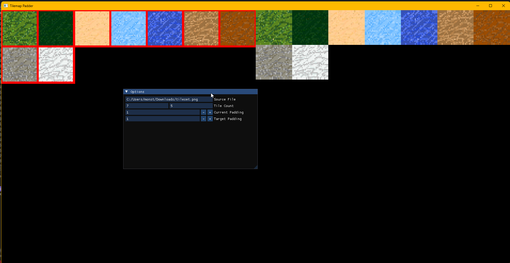

# Tilemap Padder

Sometimes when you have a tilemap and you zom on it or move your view around you can get some bleeding of adjacent textures which causes lines to appear across the whole screen.

A common way to combat this is to add some padding between the textures in your tilesheet and fill the padding with the color of the tiles, this is exactly what this tool does!

Just clone, configure cmake and build, the cmake configuration will automatically pull the dependencies and build them for you!
